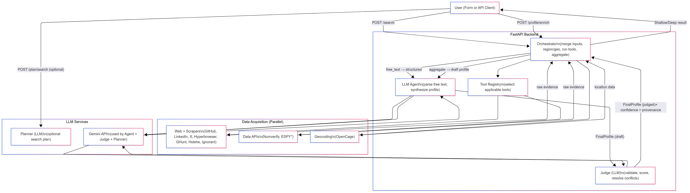

# People DeepSearch AI – MVP

DeepSearch AI is an MVP backend for background check and identity discovery. Given minimal inputs (name, email, phone, username, optional free-text context), it gathers public evidence, synthesizes a draft profile using LLMs, and performs a judge pass to validate and score the final profile.

## What it does

- Accepts person identifiers and optional free-text context
- Plans (optional) a search strategy via LLM
- Runs parallel tools (APIs + scrapers) to collect evidence
- Synthesizes a coherent profile via LLM
- Performs a judge pass via LLM to validate, score confidence, and add provenance
- Returns candidates (shallow) and a judged FinalProfile (deep)

## High-level architecture

## Key components

- Orchestrator (`services/orchestrator.py`)
  - Merges inputs, infers region, geocodes, runs tools in parallel via `ToolRegistry`, caches/uses best links, aggregates evidence, calls LLM agent and judge.
- Tool Registry (`tools/registry.py`)
  - Selects applicable tools per stage (shallow/deep). Executes async in parallel.
- Tools (in `tools/`)
  - Web scrapers (GitHub, LinkedIn, X, Hyperbrowser), OSINT (GHunt, Holehe, Ignorant), Data APIs (Numverify, ESPY).
- LLM Agent (`services/ai_agent.py`)
  - Parses free-text to structure, synthesizes profile.
- Judge (`services/judge.py`)
  - Validates profile using raw evidence, outputs confidence and provenance.
- Planner (`services/planner.py`)
  - Optional plan generation based on tool manifest and inputs.
- Geocoding/Region (`services/geocoding.py`, `services/region.py`)
  - Normalizes location context.

## API Endpoints

- POST `/search` → shallow results: candidates + raw evidence
- POST `/profile/enrich` → deep results: judged `FinalProfile` + raw evidence
- POST `/plan/search` → optional LLM-generated plan for shallow
- POST `/plan/enrich` → optional LLM-generated plan for deep
- GET `/` → serves minimal demo UI in `static/index.html`

Request payloads follow `schemas.py` (`SearchQuery`, `Candidate`). Responses use `ShallowResponse`, `DeepResponse`, `PlanResponse`.

## Running locally

1. Python 3.12+ recommended. Create and activate venv.
2. Install deps:
   - `pip install -r requirements.txt`
3. Environment:
   - `GEMINI_API_KEY` (required for LLM features)
   - Optional: `ESPY_ENABLE=true` and ESPY creds if you have them
   - Optional LLM model envs:
     - `GEMINI_PLANNER_MODEL` (default: `gemini-2.5-flash`)
     - `GEMINI_SYNTHESIS_MODEL` (default: `gemini-2.5-pro`)
     - `GEMINI_JUDGE_MODEL` (default: `gemini-2.5-pro`)
4. Start API:
   - `uvicorn main:app --reload`
5. Visit:
   - `http://localhost:8000` for demo front-end
   - Use `test_api.py` for a simple API walk-through

## Data flow summary

- Shallow: Inputs → normalize/geo/region → select+run tools → candidates + raw
- Deep: Candidate → run tools (+ targeted verifies) → synthesize (LLM) → judge (LLM) → final profile

## Notes

- ESPY tools are optional; gated by `ESPY_ENABLE`.
- Hyperbrowser scrape/extract/crawl are used when URLs are available or inferred.
- Judge pass enforces evidence-first policy, resolves conflicts, assigns confidences, and records provenance.